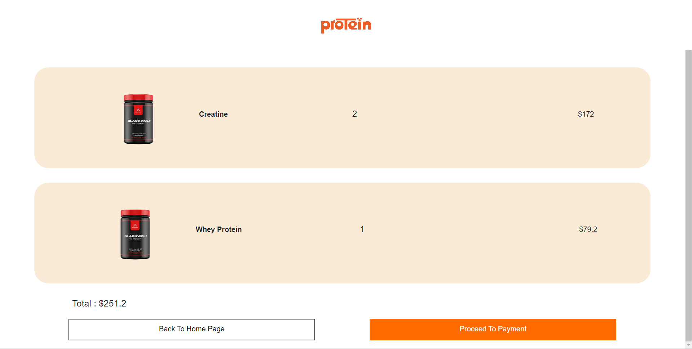

# Supplements-Store-Ui-Dotnet

Welcome to the Supplements Store UI project built using .NET. This repository contains the frontend code for a supplements store application. The main features of the application include product listings, a shopping cart, user authentication, and order management.

## Table of Contents

- [Features](#features)
- [Installation](#installation)
- [Usage](#usage)
- [Screenshots](#screenshots)
- [Contributing](#contributing)
- [License](#license)

## Features

- **Product Listings**: Browse through a variety of supplements with detailed descriptions.
- **Trending Products**: Have a look on banners of trending products.
- **Shopping Cart**: Add products to your cart and manage your selections.
- **User Authentication**: Register and log in to your account.


## Installation

1. **Clone the repository**:
    ```bash
    git clone https://github.com/ShayanAkhtar/Supplements-Store-Ui-Dotnet.git
    cd Supplements-Store-Ui-Dotnet
    ```

2. **Install dependencies**:
    ```bash
    dotnet restore
    ```

3. **Build the project**:
    ```bash
    dotnet build
    ```

4. **Run the application**:
    ```bash
    dotnet run
    ```

## Usage

Once the application is running, you can access it in your web browser at `http://localhost:5000`.

- **Browse Products**: Navigate through the supplements and view detailed information.
- **Add to Cart**: Select the supplements you wish to purchase and add them to your cart.
- **Checkout**: Proceed to checkout, provide shipping details, and place your order.
- **User Account**: Register or log in to track your orders and manage your profile.

## Screenshots

### SignUp


### SignIn


### Home Page


### Product Listing


### Shopping Cart



## Contributing

Contributions are welcome! Please fork the repository and submit a pull request with your changes. For major changes, please open an issue first to discuss what you would like to change.

1. Fork the repository.
2. Create a new branch (`git checkout -b feature-branch`).
3. Commit your changes (`git commit -m 'Add some feature'`).
4. Push to the branch (`git push origin feature-branch`).
5. Open a pull request.

## License

This project is licensed under the MIT License - see the [LICENSE](LICENSE) file for details.
